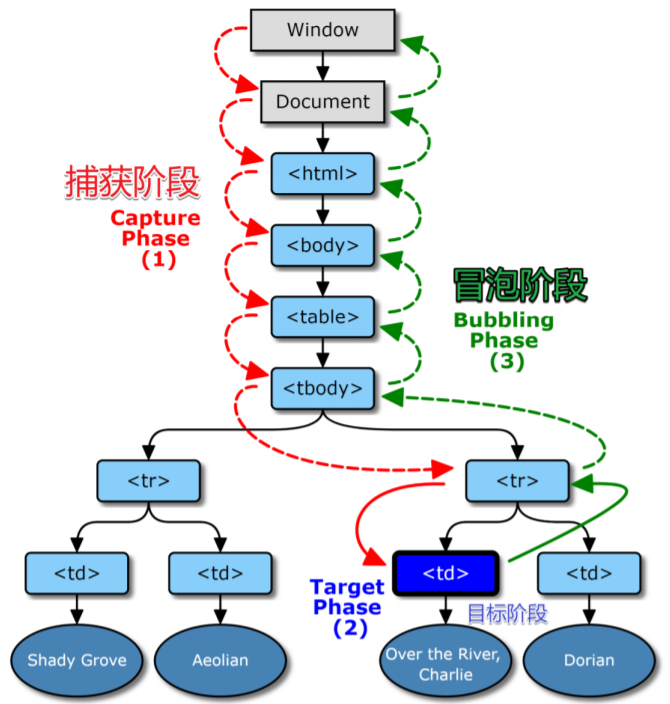
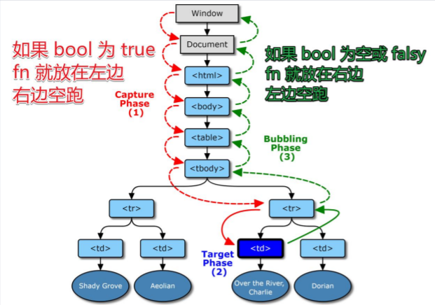

# DOM 事件&事件委托

## 一、DOM 事件

事件是用户或者浏览器自己执行的某种动作，是文档或者浏览器发生的一些交互瞬间，比如点击（click）按钮等，这里的 click 就是事件的名称。DOM 就是由浏览器提供用来帮助实现 JS 和 html 交互的，DOM 支持的事件就叫做 DOM 事件。

## 二、DOM 事件流

DOM 是个树形结构，当我们点击（click）一个按钮，html 页面上的元素会按照一定的顺序来接收并触发这个点击事件。事件流描述的就是事件发生的顺序。
但是对于这个顺序，IE 和 Netscape 提出了几乎是完全相反的事件流的概念。于是有了（IE）事件冒泡流和（Netscape）事件捕获流。

### 1. 事件冒泡

事件由最具体的元素接收，然后逐级向上传递，询问过程中的每一级节点，直到传播到 document 对象，Chrome 浏览器会冒泡到 window 对象。

### 2. 事件捕获

从最上级节点向最具体的节点传递，一般是从 document 对象开始向下传递。

### 3. DOM 事件模型



## 三、事件绑定 API

```javascript
div1.addEventListener("click", fn, bool);
```

参数 bool 值为 falsy（默认），则 fn 使用事件冒泡
参数 bool 值为 true，则 fn 使用事件捕获



### 1. 执行顺序

- 默认情况先捕获再冒泡
- 特例
  - 先监听谁先执行谁，按代码前后顺序执行

```javascript
div.addEventListener("click", f1);
div.addEventListener("click", f2, true);
```

### 2. 取消冒泡

- 捕获不可取消，但冒泡可以
- e.stopPropagation() 可以中断冒泡，让浏览器不再往上走。
- 一般用于封装独立组件。

### 3. target & currentTarget

- e.target 是用户操作的元素
- e.currentTarget 是程序员监听的元素

- 举例：监听 div 时
  - div > span{文字}，用户点击文字
  - e.target 就是 span
  - e.currentTarget 就是 div

## 四、事件信息对象 event

在事件触发时，会返回一个事件信息对象 event，在 addEventListener 的 fn 参数中给定一个任意名称的参数来接收 event

```javascript
let div1 = document.getElementsByTagName("div")[0];
div1.addEventListener(
  "click",
  (e) => {
    console.log(e);
  },
  false
);
```

- 注意：
  - event 只在事件触发的瞬间存在，事件结束，event 就不存在了。如果不是在触发同时接收（如存在 setTimeout），则应该先定义一个变量来接收 event 对象

## 五、自定义事件

- 举例：自定义事件 newEvent

```html
<body>
  <div id="div1">
    <button id="button1">点击触发自定义事件newEvent</button>
  </div>
</body>
```

```javascript
button1.addEventListener("click", () => {
  const event = new CustomEvent("newEvent", {
    detail: { name: "newEvent" },
  });
  button1.dispatchEvent(event);
});
button1.addEventListener("frank", (e) => {
  console.log("newEvent");
  console.log(e);
});
```

## 六、DOM 事件委托

### 1. 事件委托

把一个元素的事件监听委托到其他元素上。

- 应用：
  在需要监听的元素暂时不存在或数量过多的时候，把事件监听绑定到其祖先元素。
- 原理：
  通过事件冒泡触发委托到祖先元素上的事件，再通过事件中的函数找到目标元素。

### 2. 装一个事件委托函数 on

```javascript
on("click", "#div", "button", () => {
  console.log("button 被点击了");
});

function on(eventType, element, selector, fn) {
  if (!(element instanceof Element)) {
    element = document.querySelector(element);
  }
  element.addEventListener(eventType, (e) => {
    let el = e.target;
    while (!el.matches(selector)) {
      if (element === el) {
        el = null;
        break;
      }
      el = el.parentNode;
    }
    el && fn.call(el, e, el);
  });
  return element;
}
```
